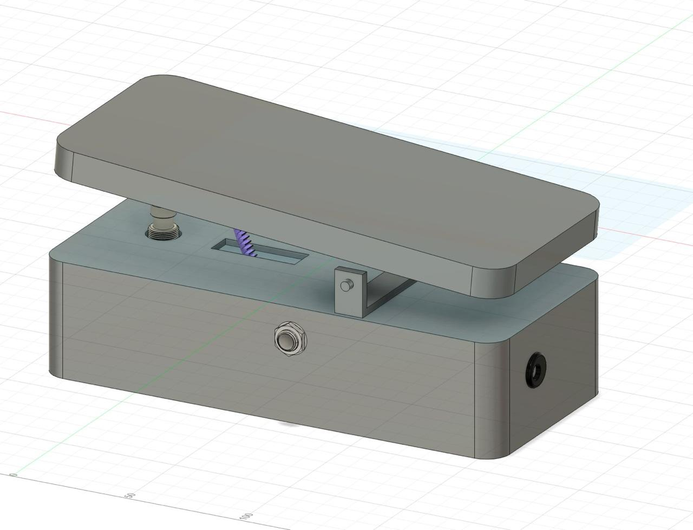
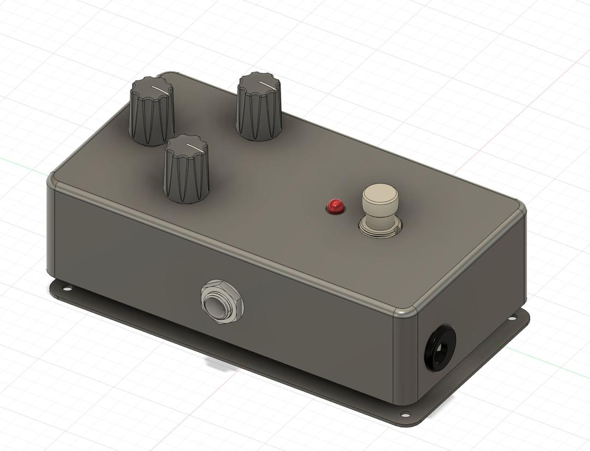

#  D’RAP – Analog Stomp box Guitar Effect Pedals

**D’RAP** is a set of fully analog guitar effect pedals—**Wah**, **Distortion**, and **Phaser**—designed to shape and enhance electric guitar tones using carefully engineered analog circuitry. Each pedal uses operational amplifiers, filters, and passive components to deliver distinct tonal characteristics with low noise and high reliability. Housed in compact enclosures and equipped with true-bypass switching, these pedals are optimized for both live and studio performance.

This project was developed as part of the EN2091 Laboratory Practice and Projects module in Semester 3.

---

  
   
   
  <em>Left: Wah Pedal (3D Render) &nbsp;&nbsp;&nbsp;&nbsp; Right: Distortion Pedal (3D Render)</em>

## 🎸 Pedal Overview

### Wah Pedal
Simulates the iconic “wah-wah” tone by sweeping frequency bands with a resonant filter circuit controlled by a potentiometer.

- Vocal-like tonal shifts ideal for expressive solos  
- Built using op-amps and active filter stages

  [Distortion demo video](https://drive.google.com/file/d/1t_KzhM_-2GQarfYOH7J1dvQNY4lg6ZpH/view?usp=sharing)

###  Distortion Pedal
Adds harmonic richness and sustain by clipping the guitar signal through a dual-stage op-amp and diode-based circuit.

- High-gain saturation suited for rock and metal  
- Adjustable tone and distortion levels

[Distortion demo video](https://drive.google.com/file/d/1ixSL9mObNiTnocfnKQdoOK-slbz-HCYX/view?usp=sharing)

###  Phaser Pedal
Creates a swirling, spacey effect by phase-shifting the signal across several frequency bands using all-pass filters and modulation.

- Adds depth and motion to clean tones  
- Analog low-frequency oscillator (LFO) driven  

---

## 🛠️ Development Process

- Circuit simulation and functional validation  
- Custom schematic design and PCB layout  
- PCB fabrication and through-hole soldering  
- Hardware assembly, testing, and debugging  
- Enclosure integration and final testing  

---

## ⚙️ Key Features

- Fully analog signal processing  
- True-bypass switching for signal transparency  
- Compatible with standard 9V DC power supply  
- Low noise design with high fidelity  
- Compact and robust construction  

---

## 📁 Repository Structure

- `schematics/` – Circuit diagrams for all pedals  
- `pcb/` – PCB layouts and Gerber fabrication files  
- `simulation/` – LTspice simulation files   
- `report/` – Reports and supporting documents  
- `images/` – Hardware build and testing photos  

---

